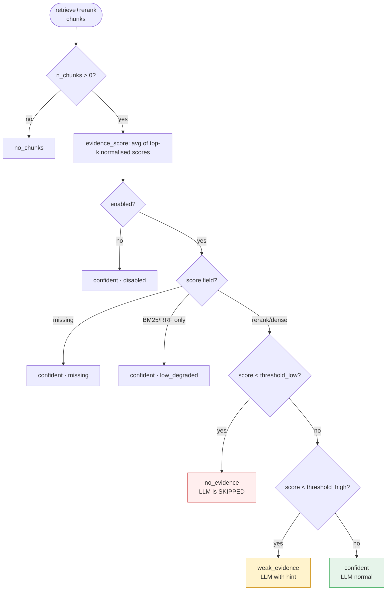
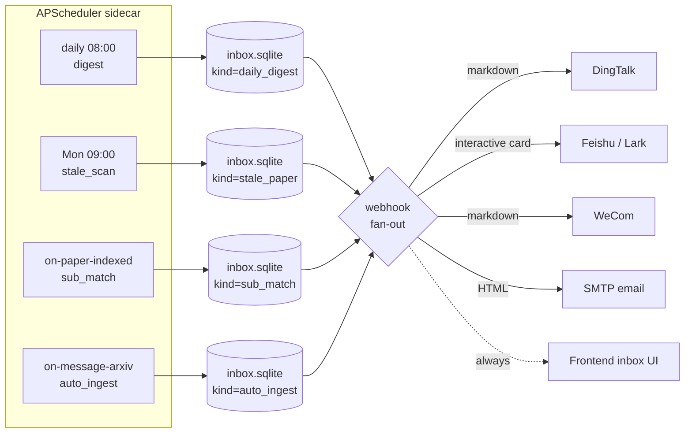
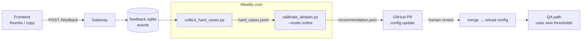
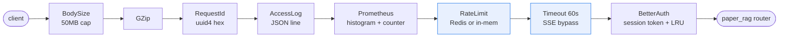

# Demo — visual walk-through

A 4-diagram tour of the internals. Read top-to-bottom or jump to whatever
caught your eye in the [README](../README.md).

## 1. Abstain decision (ADR-0014)

The single decision that makes the difference between "answer with the
evidence we have" and "decline cleanly". Three bands, six branches, no
LLM call below 0.21:

Calibration data lives in `tests/eval/abstain_calibration_report.json`,
re-run via `make calibrate-abstain` (offline) or
`scripts/calibrate_abstain.py --mode online` (real LLM).

---

## 2. Proactive scheduler (M9)

Daily / weekly cron plus 4 push channels. The scheduler is a separate
sidecar container so a cron crash does NOT take the QA gateway down.

Webhook failures never block inbox writes, but they DO log a warning so
misconfigured endpoints surface in production. See ADR-0018 + the
`proactive/webhook.py` `@register` decorator.

---

## 3. Feedback data loop (M11)

Thumbs-down / copy-answer events feed back into the threshold calibrator.
The loop is **semi-automatic** by design — humans review the proposed new
thresholds before they ship.

This is why we keep `enabled: true` on abstain even before final
calibration — the running thresholds are *meant* to drift slowly with
real-user signal, not be locked in once.

---

## 4. Gateway middleware stack

Eight layers, in the exact request order. The two most important
properties: **timeout bypass for SSE** (so streaming answers don't get
cut at 60s) and **rate-limit fail-open** (Redis outage falls back to an
in-memory window instead of 429-ing everyone).

Cardinality control: `path_template` is normalised to `/papers/:id` style
before it reaches Prometheus, otherwise per-request UUIDs would explode
the metric series. ADR-0020 covers the full design.

---

## See also

- [`SYSTEM_DESIGN.md`](SYSTEM_DESIGN.md) — 30-minute walkthrough
- [`PERF_BASELINE.md`](PERF_BASELINE.md) — latency + throughput numbers
- [`adrs/`](adrs/) — 21 frozen design decisions
- [`diagrams/abstain_flow.md`](diagrams/abstain_flow.md) — sequence diagram
- [`../examples/`](../examples/) — runnable Python walk-throughs
