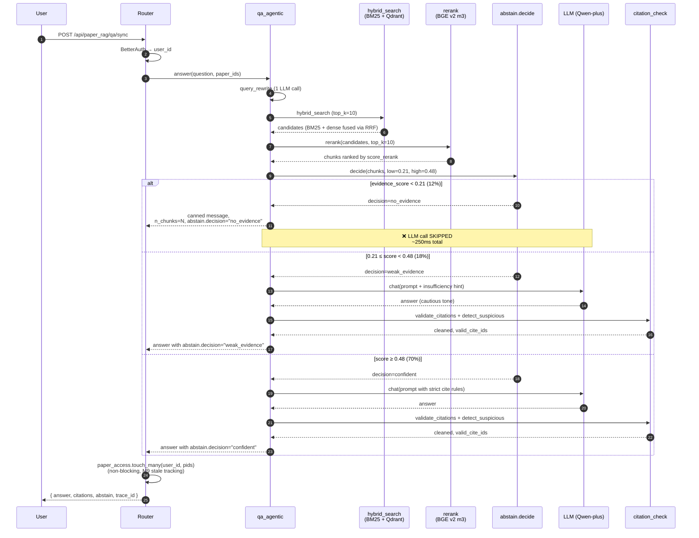

# abstain_flow.md — abstain 三档拒答时序图

> 对应 ADR-0014 / qa_agentic.py / qa_stream.py
> 阈值标定参见 `EVAL_REPORT.md`

## 关键点

- **abstain 是延迟节流器**：12% no_evidence 直接 skip LLM，把 P50 从 ~2s 拉到 ~250ms
- **fail-open 不在这一层**：reranker 挂了走 BM25 score，但 abstain 仍然按 score_field 分档
- **paper_access.touch 在 router 层**：QA 完答完后异步写入，喂数据给 stale_scan
