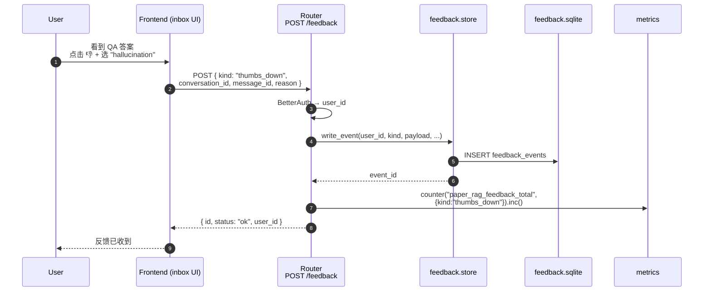
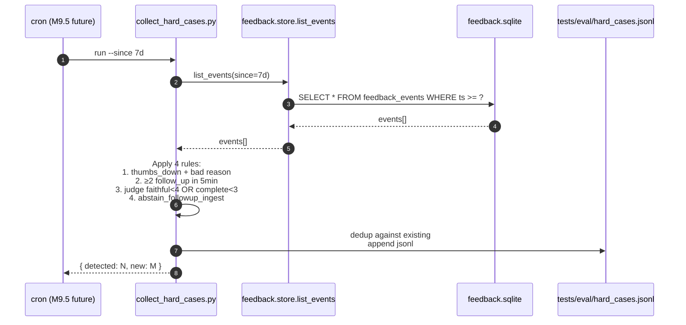
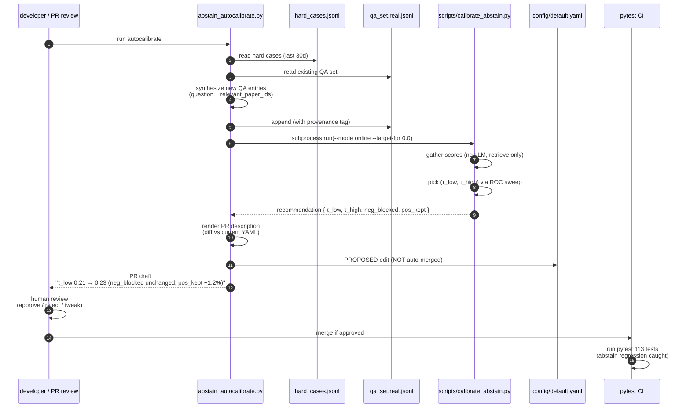

# feedback_loop.md — M11 数据闭环时序图

> 对应 ADR-0017 / feedback 包 + collect_hard_cases.py + abstain_autocalibrate.py

## 1. 用户反馈写入

## 2. 周一定时收集 hard cases

## 3. 半自动 abstain 阈值再校准

## 关键点

- **闭环不是全自动**：阈值变更走 PR review，人工把关
- **abstain_autocalibrate 解耦数据收集与阈值更新**：collect 是数据流向 jsonl，calibrate 是 jsonl 到阈值
- **regression net**：pytest 里 `test_abstain_thresholds_sane` 检查 0 < τ_low < τ_high < 1
