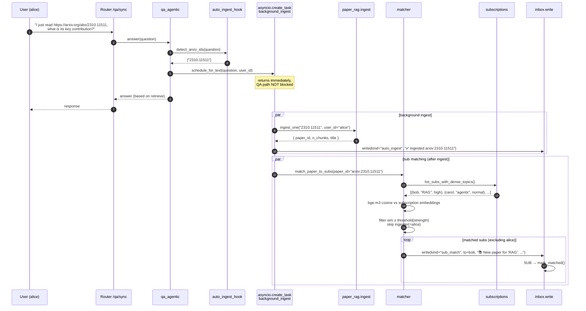
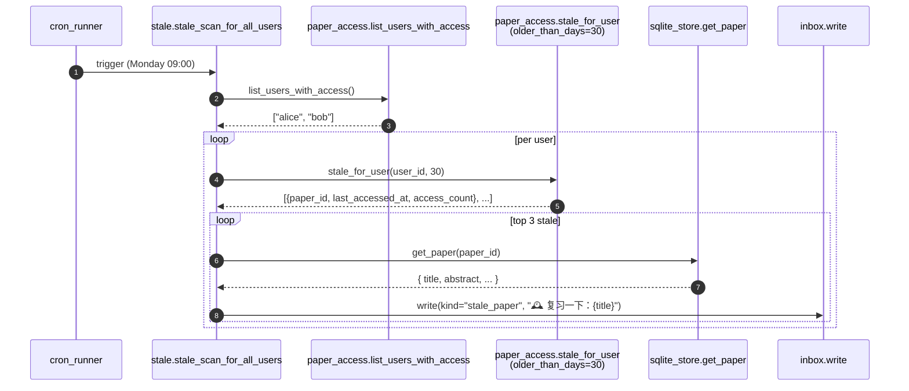

# proactive_flow.md — M9 主动 Agent 时序图

> 对应 ADR-0018 / proactive 包 7 模块 + cron_runner

## 1. daily_digest 推送（cron sidecar）

```mermaid
sequenceDiagram
    autonumber
    participant CR as cron_runner<br/>(APScheduler @ 08:00)
    participant D as digest.daily_digest_for_all_users
    participant S as subscriptions.list_users
    participant A as arxiv API
    participant T as small_model (TL;DR cache)
    participant I as inbox.write
    participant W as webhook.fan_out
    participant DB as feedback.sqlite

    CR->>D: trigger
    D->>S: list_users()
    S-->>D: [alice, bob, ...]
    loop per user
        D->>S: list_keywords(user_id)
        loop per keyword
            D->>A: search latest arxiv (last 24h, max=5)
            A-->>D: papers[]
        end
        D->>D: dedup by arxiv_id
        loop per paper (max 10)
            D->>T: tldr(paper_id)<br/>(cross-user cache, 100x cost saving)
            T-->>D: 50-char TL;DR
        end
        D->>D: render_digest_card(bullets)
        D->>I: write(kind="daily_digest", title, body_md, ...)
        I->>DB: INSERT inbox_items
        I->>W: fan_out(item) [P3-13]
        W->>W: list_webhooks(user_id)
        par dingtalk
            W->>+W: HMAC sign + POST
        and feishu
            W->>+W: card payload + POST
        and email
            W->>+W: SMTP send
        end
        W-->>I: { sent: N, results: [...] }
    end
    CR-->>CR: log result, sleep until next trigger
```

## 2. 订阅匹配 + 自动 ingest（QA 流处理 hook）



## 3. stale_scan（每周一 09:00）



## 关键点

- **3 类推送共享 `inbox.write`**：唯一写入点 → 唯一触发 webhook fan-out
- **跨用户 TL;DR 缓存**：digest 阶段 100x 成本节省
- **ingester 不收自己的 sub_match**：避免噪声
- **背景 ingest 永不阻塞 QA**：`asyncio.create_task` + best-effort
